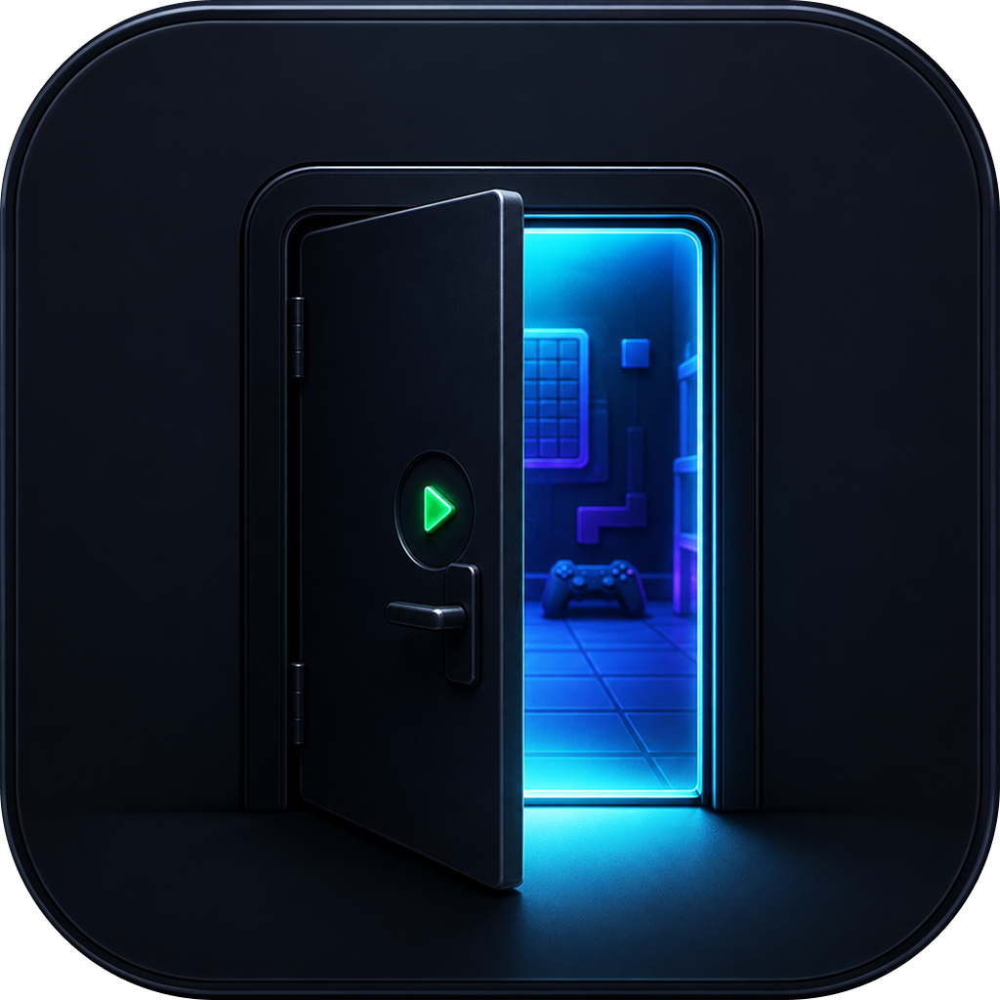

<p align="center">
  
</p>

# Playroom

Playroom is an Expo-focused mini 2D game editor/runtime MVP. It provides a
local browser editor, a JSON scene/project schema, and runtimes that consume the
generated project files.

The current public scope is intentionally small: Playroom should do the core
scene-editing workflow well before expanding into a larger engine.

## What is included

- `@gamekit/schema`: shared JSON scene and project contract.
- `@gamekit/runtime`: Expo runtime for Skia rendering, player movement, camera follow, and AABB collision helpers.
- `@gamekit/cli`: Node CLI for init, asset import, generated asset registry, and the local editor server.
- `@gamekit/editor`: Vite/React browser editor served by the CLI.
- `@gamekit/mcp`: MCP server exposing project and scene operations to agents.
- `templates/expo-game`: starter Expo project.

## MVP Scope

In scope:

- Project initialization and local editor server.
- JSON scene/project files.
- Canvas editing for entities, sprites, AABB colliders, player controller, and camera follow.
- Image asset import/remove/generate.
- Scene file management.
- Expo/Skia runtime and starter export.
- MCP tooling as an integration surface.

Still evolving (see `ROADMAP.md`):

- Full Skia/Phaser play host inside the editor (current play mode is a fixed-timestep sim).
- Production cross-runtime parity budgets and docs site hosting.
- Deeper GUI editing and advanced VFX (beyond ParticleSystem MVP).

## Commands

```bash
pnpm install
pnpm build
pnpm test
pnpm gamekit init
pnpm gamekit editor
pnpm gamekit doctor
pnpm gamekit build --platform mobile
pnpm gamekit dev
```

The editor server defaults to `http://127.0.0.1:4177`.

## Documentation

See [`docs/`](./docs/index.md) for getting started, CLI reference, editor/agent, and schema guides.

## Repository Structure

- `apps/editor`: browser editor UI.
- `packages/schema`: shared schema and validators.
- `packages/runtime`: Expo/Skia runtime.
- `packages/runtime-web`: Phaser runtime prototype.
- `packages/cli`: `gamekit` command.
- `packages/mcp`: MCP server and tools.
- `templates`: exportable starter projects.

## Contributing

Read `CONTRIBUTING.md` before opening a pull request. The short version:

- Branch from `develop` for code changes.
- Branch from `docs` for documentation work.
- Branch from `examples` for sample projects and templates.
- Keep changes scoped and run `pnpm typecheck`, `pnpm test`, and `pnpm build` when relevant.

See also:

- `BRANCHES.md`
- `CODE_OF_CONDUCT.md`
- `SECURITY.md`
- `SUPPORT.md`
- `GOVERNANCE.md`

## License

MIT. See `LICENSE`.
