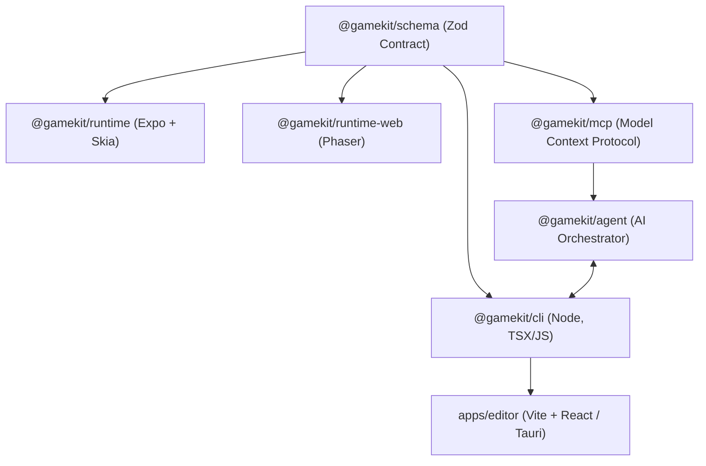
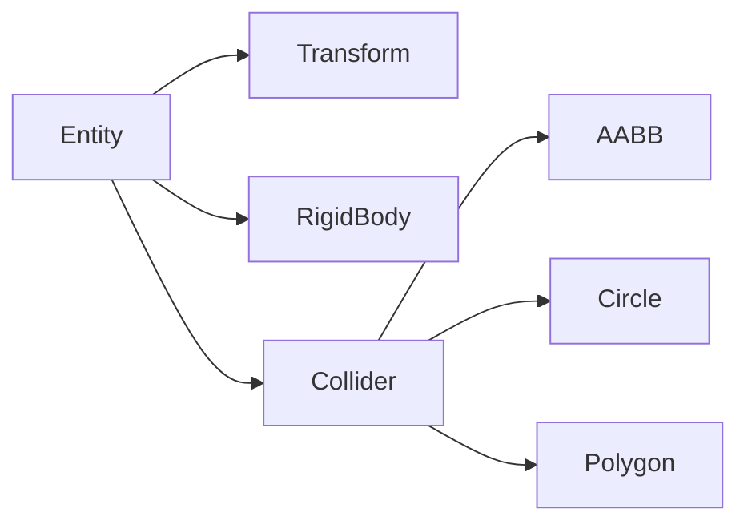

# Playroom — Detailed Development Roadmap (Master Roadmap)

> **Status source of truth:** root [`ROADMAP.md`](./ROADMAP.md) (E2E Ready baseline, English).
> This file is a historical design deep-dive; many tasks below are already shipped.
> Prefer `ROADMAP.md` for checkboxes and next priorities.

This document tracked the tasks required to evolve Playroom from its MVP 0.1 state into a production-ready, cross-platform, AI-native 2D game engine and editor.

---

## 1. Architectural Overview and Core Principles

Playroom utilizes a **schema-driven** architecture where game components are defined via Zod schemas under `@gamekit/schema`. Every other package (Vite-based editor, Expo/Skia mobile runtime, Phaser web runtime, and the MCP server) is generated and validated against these schemas.



---

## 2. Phase-by-Phase Roadmap

### Phase 1: Advanced Physics and Collision World
Currently, only static AABB colliders are supported, and there are no rigid bodies or movement dynamics. This phase adds physical realism and flexibility to the game.



#### Tasks and Code Changes
- **`@gamekit/schema`:**
  - Add `CircleCollider` and `PolygonCollider` component schemas to `packages/schema/src/index.ts`.
  - Add the `RigidBody` component schema: `velocity: {x, y}`, `angularVelocity: number`, `mass: number`, `drag: number`, `isKinematic: boolean`, `gravityScale: number`, `useGravity: boolean`.
- **`@gamekit/runtime` (Skia) & `@gamekit/runtime-web` (Phaser):**
  - **Physics Update Loop:** Integrate a fixed-timestep accumulator (sabit `dt = 1/60`) into `loop.ts` to manage delta time accumulation, ensuring frame-rate independent (deterministic) physics steps.
  - **Collision Solver:** Implement AABB-AABB, AABB-Circle, Circle-Circle, and basic Polygon SAT (Separating Axis Theorem) collision detection and resolution algorithms.
  - **Collision Layers & Masks:** Manage collision layers using bitwise masks. Filter collisions with `layer` (group membership) and `mask` (groups it collides with) to optimize performance.
  - **Trigger Events:** Implement a trigger system that does not produce solid collisions but fires `onTriggerEnter` / `onTriggerExit` events on overlap.
  - **Raycasting:** Add a raycasting function to find linear intersections. Map it to the editor's mouse picking tools.

#### New MCP Tools
- `add_collider` — Attaches a `CircleCollider` or `PolygonCollider` to an entity.
- `add_rigid_body` — Grants an entity physical mass and motion properties.
- `set_collision_layer` — Configures the collision layer and mask of an entity.
- `raycast` — Scans the scene from a start point along a direction vector.

#### Skill Template Updates
- `packages/mcp/skills/physics-puzzle.json`: A slingshot-style puzzle template (similar to Angry Birds) using gravity, mass, and elastic collisions.

---

### Phase 2: Rich Component & System Library
To accelerate content creation and enhance visual/audio immersion, core component types will be expanded.

#### Tasks and Code Changes
- **Tilemap and TileSet Integration:**
  - Implement a parser to read Tiled Editor (`.json`/`.tsx`) files.
  - Build an editor UI featuring a paint brush, eraser, and Tile palette.
- **Metatext Component (`TextComponent`):**
  - Accept font files (`.ttf`, `.otf`) as assets.
  - Add alignment, font size, and line height parameters to the schema and rendering loops.
- **Audio Infrastructure (`AudioSource` & `AudioListener`):**
  - Support importing mp3, wav, and ogg files.
  - Implement spatial 2D audio panning and attenuation based on distance.
- **Effect Systems (`ParticleSystem` & `Light2D`):**
  - Emitter parameters: `lifetime`, `rate`, `speed`, `colorOverLife`, `gravityEffect`.
  - 2D Lighting: Integrate with Phaser's built-in light masks and Skia's shader-based blend modes.

#### New MCP Tools
- `add_tilemap` — Loads tilemaps and tilesets into the scene.
- `paint_tile` — Places tiles at specific grid coordinates.
- `import_audio` — Imports audio assets.
- `add_particle_system` — Creates visual emitter effects.

#### Skill Template Updates
- `packages/mcp/skills/tower-defense.json`: A path-following (`Path2D`) enemy wave game template with towers and particle hit effects.

---

### Phase 3: Input, Devices, and Controls
To run games seamlessly on mobile, web, and consoles, a general input manager will be implemented.

#### Tasks and Code Changes
- **Input Action Mapping:**
  - Define abstract actions like `"jump"`, `"shoot"`, `"move_x"`.
  - Map these actions to keys, touch screen zones, or gamepad buttons.
- **Virtual Joystick:**
  - Render mobile-friendly on-screen d-pads and analog sticks.
- **Touch Gesture Recognizers:**
  - Standardize pointer inputs to normalize swipe, pinch, and hold gestures.

#### New MCP Tools
- `define_input_action` — Configures a new input action and button bindings.
- `bind_input_action` — Connects actions to scripts or entities.
- `simulate_input` — Emits synthetic inputs for headless tests.

---

### Phase 4: Scene Management, Persistence, and Prefabs
To support multi-level games, scene transitions and state management must be solved.

#### Tasks and Code Changes
- **Scene Transition Manager (`SceneManager`):**
  - Manage scene loads with fade, slide, or zoom transition effects.
- **Persistent State Store:**
  - Keep game variables (e.g. gold, player health, levels unlocked) active across scene loads using a global `GameStore`.
  - Save state to disk using `localStorage` on web and `AsyncStorage` on Expo (Save/Load).
- **Prefabricated Entities (Prefabs):**
  - Export entities as reusable template files (`.prefab.json`).
  - Instantiate and clone prefabs dynamically at runtime.

#### New MCP Tools
- `load_scene` — Triggers a scene change with transitions.
- `create_prefab` — Generates a template from an existing entity.
- `instantiate_prefab` — Spawns a prefab instance in the scene.
- `save_game` / `load_game` — Serializes/deserializes game progression.

---

### Phase 5: Editor and Play-in-Editor (PIE)
To give a true engine experience, live simulation and debug views will be embedded in the editor.

#### Tasks and Code Changes
- **Play-in-Editor:**
  - Run, pause, and step frame-by-frame inside the Vite editor canvas.
- **Visual Gizmos:**
  - Render physics shapes using green (collider) and blue (trigger) outline overlays.
  - Draw translation, rotation, and scaling gizmos over the active selection.
- **Hot-Reload Support:**
  - Automatically update the canvas if scene JSON files are modified externally.

#### New MCP Tools
- `play_scene` / `stop_scene` / `pause_scene` — Simulates the active scene.
- `editor_set_camera` — Directs the editor's zoom and pan.
- `validate_scene_visual` — Analyzes rendering outputs for layout regressions.

---

### Phase 6: CLI and Developer Experience (DX)
Add production-ready compiling, optimization, and environment validation tools.

#### Tasks and Code Changes
- **`gamekit dev` (Watch Mode):**
  - A dev server that watches scene and component source changes to trigger instant hot reloads.
- **`gamekit build` (Prod Bundle):**
  - Compress JSON scene descriptors, minify assets, and pack sprite sheets into optimized texture atlas sheets.
- **`gamekit doctor`:**
  - Audit missing assets, compile syntax errors, and flag malformed schemas.

#### New MCP Tools
- `build_project` — Generates production build bundles.
- `run_doctor` — Inspects the local workspace setup.

---

## 3. AI Game Agent (BYOK) Architectural Details (Deep Dive)

The defining feature of Playroom is its integrated AI Agent, enabling users to build games using their own API keys (Bring Your Own Key) directly from the editor's panel.

```
+-------------------------------------------------------------+
|                     apps/editor UI                          |
|  +------------------------+  +---------------------------+  |
|  |     AgentPanel.tsx     |  |     AgentSettings.tsx     |  |
|  |    (Chat & Trace)      |  |   (API Key Vault, Model)  |  |
|  +-----------+------------+  +-------------+-------------+  |
+--------------|-----------------------------|----------------+
               | Chat / SSE Stream           | Setup keys
               v                             v
+-------------------------------------------------------------+
|              packages/cli (API Server: 4177)                |
|  +-------------------------------------------------------+  |
|  |                 /api/agent/* Endpoints                |  |
|  |  - /chat (SSE)    - /approve      - /history          |  |
|  |  - /keys          - /models       - /abort            |  |
|  +---------------------------+---------------------------+  |
|                              | stdio                        |
|                              v                              |
|  +-------------------------------------------------------+  |
|  |            packages/agent (AI Loop)                   |  |
|  |   +-----------------------------------------------+   |  |
|  |   | ReAct Agent Loop                              |   |  |
|  |   | - Provider Adapters (Anthropic, OpenAI, etc.) |   |  |
|  |   | - MCP Client (spawns packages/mcp process)    |   |  |
|  |   | - Approval Manager (destructive limits)        |   |  |
|  |   | - History & Context Injection                 |   |  |
|  |   +-----------------------------------------------+   |  |
|  +-------------------------------------------------------+  |
+-------------------------------------------------------------+
```

### A. `@gamekit/agent` Package Breakdown
This package implements the ReAct loop:
- **`providers/`**: Uniform API adapters for models.
  - `anthropic.ts` (Sprint A): Handles tool-use and SSE streaming with Claude 3.5 Sonnet.
  - `openai.ts`, `google.ts` (Sprint B): Connects to GPT-4o and Gemini 1.5 Pro.
- **`mcp/`**: A `stdio` based client interface to connect with `packages/mcp`.
  - Maps Playroom's 34 MCP tools to the model's native format.
- **`loop/agent.ts`**: Orchestrates the ReAct execution flow: prompts, model thinking, tool invocation, and feeding results back.

### B. Security & Approval Modes
To avoid accidental file wipes, the agent respects strict permission parameters.
- **Modes:**
  - `destructive-only` (Default): Modifying or removing entities requires manual user clicks in the UI. Additions happen automatically.
  - `always`: Every tool call stops for user validation.
  - `off`: Ajan operates completely autonomously.
- **Credential Storage:**
  - Web: Keys reside in local browser storage (`localStorage`), masked on screen.
  - Tauri: Desktop shells fetch keys from OS Keychain APIs via `tauri-plugin-stronghold`.
  - Console logs always filter out and redact key patterns (`***REDACTED***`).

### C. SSE Event Transmission Protocol
Live tool runs stream output to the UI using a structured Server-Sent Events flow:

```json
event: token
data: {"text": "Adding a jumping behavior to the player entity..."}

event: tool_start
data: {"tool": "add_component_instance", "arguments": {"entityId": "player-1", "componentType": "PlayerController"}}

event: approval_request
data: {"requestId": "req-9821", "tool": "remove_entity", "arguments": {"entityId": "old-obstacle"}}

event: tool_result
data: {"tool": "add_component_instance", "ok": true, "result": "Component successfully attached."}

event: done
data: {"summary": "Player configured with physics attributes."}
```

---

## 4. Platform & Parity Verification (Phase 8)
Playroom supports two separate runtimes: Expo/Skia for mobile and Phaser for Web.
- **Behavior Alignment:** Ensure physics updates (fixed dt) and canvas transform coordinate spaces match identically.
- **Visual Regression:** Compare rendered canvas frames side-by-side using pixel diff checks to eliminate graphic layout bugs.

---

## 5. Development Timeline and Milestones

| Sprint | Focus | Deliverable |
| --- | --- | --- |
| **Sprint 0** | **AI Agent Foundation** | `packages/agent` setup, Anthropic provider, editor chat drawer, SSE streaming, and BYOK settings vault. |
| **Sprint 1** | **Physics Engine** | `RigidBody` and `CircleCollider` schemas, fixed-timestep update loop, collision resolver, and Vitest suite. |
| **Sprint 2** | **Editor PIE** | Play-in-Editor controls, physics gizmos, Tile Set paint brush tools. |
| **Sprint 3** | **Rich Assets** | AudioSource playback, text rendering components, prefab export/import, and disk Save/Load. |
| **Sprint 4** | **Behavioral Scripting** | Easing/Tween curves, state machines, and event handlers mapped via JSON DSL scripts. |
| **Sprint 5** | **Agent Enhancements** | OpenAI/Gemini/Ollama providers, Tauri keychain integration, and visual trace loggers. |
| **Sprint 6** | **Vision Agent** | `/screenshot` commands, visual canvas debugging, and plan-on-approval pipelines. |
| **Sprint 7** | **Optimizations & Stress** | 1000+ Entity performance budget profiling, Skia vs. Phaser automated pixel regressions. |
